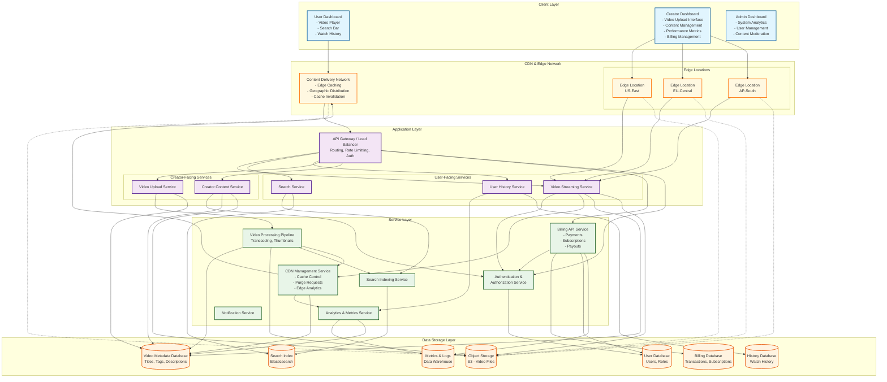

## Initial Requirements (100,000 users/hour):

* Concurrent streams: ~28,000 (assuming 10-minute average watch time)
* Storage needed:
  * Daily Active users (DAU): 2,400,000 (100k/hr)
  * Average video uploaded per user per day: 0.005 videos (0.5 % of DAUs upload a video daily)
  * Average video size: 100 MB (at 1080p resolution, H264 compression)
  * Daily uploads: 2,400,000 x 0.005 = 12,000 videos/day
  * Daily storage for uploads: 12,000 x 100 MB = 1.2 TB/day
  * Annual video uploads: 1.2 TB/day x 365 days = 438 TB/year
  * With 3× replication: 438 TB x 3 = 1.314 PB/year

* Chunk operations:
* 100 MB video =   (64 - 256 MB each)


## System Scaling Projections - After 12 months (10% monthly growth): TODO recalculate

* Users: 100,000 × (1.10)¹² ≈ 314,000 users/hour
* Storage: 45 PB × 3.14 ≈ 141 PB
* Monthly uploads: 314,000 videos = 4.71 billion chunks


## Adaptive Bitrate Streaming (ABS)

```
Type           Video bitrate 24, 25, 30 fsp
2160p (4k)     35,000-45,000 kbps
1440p (2k)     16,000 kbps
1080p (HD)      8,000 kpps
720p            5,000 kbps
480p            2,500 kbps
360p            1000 kbps
```

* On-Demand
 * HTTP Streaming (HLS)
 * Dynamic Adaptive Streaming over HTTP (DASH)

* LIVE
 * RTMP
 * DASH


Video Assets -> Transcoder => (Bitrate Variants) => MPEG-DASH Package and Encryption -> DASH MPD and chunks on OS -> CDN -> <--Request/Serve Video Segments and MPD --> MPEG-DASH Video Player 

* Functional Requirements  Non Functional Requirements
 * Video Upload - Low latency: the system should allow users to upload video files with various formats and sizes, efficiently and securely, this includes handling large files providing progresss feedback and supporting resumable uploads in case of interruptions
 * Encoding and Transcoding - High Availability: the system needs to process and convert uploaded videos into multiple standardized formats and resolutions, this ensures compatibility across different devices and network conditions, enabling smooth playback for all users
 * Streaming Video Content- High Scalability:  the system should also enable users to stream video content seamlessly, it must support adaptive bit rate streaming to adjust video quality in real time based on the user's network speed and device capabilities as well as to minimize buffering and to ensure a high quality viewing experience.
 * Notifications




### CDN Layer

* CDN Management Service: Handles cache control, purge requests, and edge analytics
* Edge Locations: Geographic distribution for low-latency content delivery
* Main CDN Node: Central CDN coordination

### Data Flow

* 

### Cache Behavior
* Solid lines: Primary request flow (cache hits)
* Dashed lines: Secondary flow (cache misses, background operations)
* Edge Locations: Serve cached content to regional users

### Fault Tolerance:

* Automatic failure detection via heartbeats
* Data durability through chunk re-replication
* Consistency via quorum reads/writes
* Recovery through checkpointing and Write Ahead Logs (WAL)
* Leadership coordination through election
* Geographic Redundancy: Multiple edge locations provide failover
* Cache Resilience: Users can continue watching cached content during origin outages
* Graceful Degradation: CDN serves stale content if origin is unavailable

### Video Streaming Fault Tolerance
* Availability
* P


### Video Upload Fault Tolerance
* Consistency
* P

### API Endpoints

* Authentication and Authorization Service

```
POST /auth/login
POST /auth/logout
POST /auth/refresh-token
```

* User-Facing Services

* Search Service

* User History Service

* Creator-Facing Services

* Creator Content Service

* Billing Service

* Payment Processing

* Creator Payouts

* Admin Services

* Analytics and Metrics

* Notification Services

* External Service Endpoints

* CDN Service

```
POST /cdn/purge/{videoId}          # Invalidate cached video
GET  /cdn/analytics/edge-stats     # Get CDN performance metrics
POST /cdn/fetch/{videoId}       # Calculate cache for anticipated demand
GET  /cdn/cache-status/{videoId}   # Check cache status across edges
```


